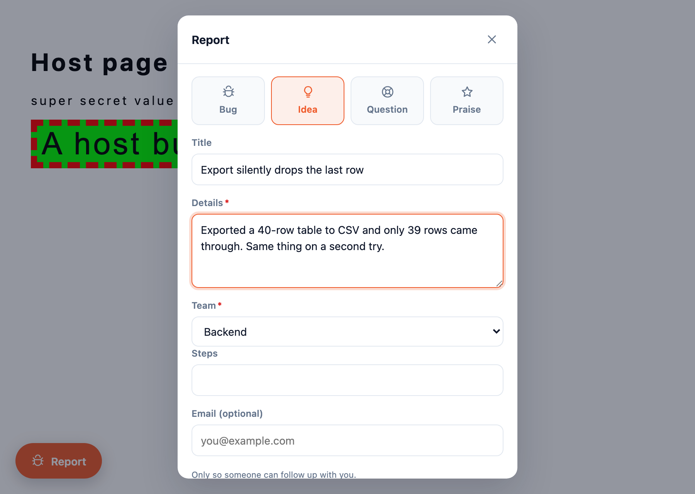

# @nerva/feedback-widget

Embeddable feedback button, modal and session recorder for Nerva feedback
projects. Drop it into any browser app; reports, replays, console output and
network activity land in that app's Nerva feedback project.

```
npm install @nerva/feedback-widget
```

```ts
import { mountFeedback } from "@nerva/feedback-widget";

const feedback = await mountFeedback({
  endpoint: "https://acme.nervaapp.com",
  publicKey: "your-feedback-project-api-key",
  user: { id: currentUser.id, email: currentUser.email, name: currentUser.name },
  metadata: { release: __BUILD__, tenant: org.slug },
});
```

No bundler? Use the global build, which can mount itself:

```html
<script src="https://acme.nervaapp.com/feedback-widget.global.js"
        data-endpoint="https://acme.nervaapp.com"
        data-key="your-feedback-project-api-key"></script>
```

<p align="center">
  
  
</p>

<sub>Captured by <code>npm test</code> against a host page that deliberately styles every
button lime with a red dashed border and letter-spaces all text — visible behind the
dialog, and stopping dead at the shadow boundary.</sub>

**71 KB gzipped**, rrweb and both capture plugins included. No runtime
dependencies beyond that; `html2canvas` is an optional peer used only for
screenshots.

---

## How it is put together

The server is the source of truth and the widget is deliberately dumb. Theme,
capture toggles, kind list, replay lookback and the custom-field schema are all
fetched at mount, so an operator changes how the widget behaves without anyone
redeploying the app it is embedded in. The host app supplies only what it alone
knows: who the user is, and what the build/tenant/release are.

```
src/index.ts        conductor - composes everything, owns the lifecycle
  config.ts         bootstrap: which contract, and what the operator configured
  recorder.ts       rrweb behind a bounded buffer
  redact.ts         non-configurable capture-time redaction
  extract.ts        splits console/network back out of the replay
  screenshot.ts     optional DOM rasterisation
  transport/        the only code that knows what the wire looks like
    v1.ts             /api/v1/feedback/*        (snake_case)
    legacy.ts         /api/feedback-collect/*   (camelCase, mirrors feedback.val)
    http.ts           gzip, multipart, typed errors
  ui/               shadow-root shell, launcher, modal, custom fields
```

Everything above `transport/` is contract-agnostic. Adding a third server
generation means adding a file there and a branch in `selectTransport`, and
touching nothing else.

### Two server contracts, chosen at mount

At mount the widget asks for `/api/v1/feedback-widgets/by-key/{key}/config`.

- **Answered** → the v1 contract, with server-driven config, custom fields, file
  attachments and the chunked replay protocol.
- **404 / refused** → the legacy `/api/feedback-collect/*` contract, which has no
  public config route, so the widget runs on its defaults plus your options.

`handle.transport` tells you which one you got. See
[docs/server-requirements.md](docs/server-requirements.md) for what each contract
needs from the server, and which parts of it Nerva implements today.

| | legacy | v1 |
|---|---|---|
| Report + replay | yes | yes |
| Console / network capture | yes | yes |
| Server-driven theme & toggles | yes | yes |
| Custom fields | parked in `metadata` | first-class |
| File attachments | dropped (names kept in `metadata`) | yes |
| Chunked replay upload | no | yes |
| Continuous session upload | yes | no |

### The replay buffer

A widget that lives as long as a tab cannot keep every event, and a naive "drop
anything older than N seconds" queue eventually drops the full snapshot the
replay is built from, leaving an unplayable tail. So the recorder uses rrweb's
own checkout mechanism: a fresh full snapshot every `lookbackMs`, two
generations kept, the older one dropped when a third arrives. Memory stays inside
`[lookback, 2 x lookback)` and whatever gets flushed always begins with a
Meta + FullSnapshot pair.

`seq` is assigned at flush time and the server orders by it. rrweb backdates
events when it merges a snapshot, so `ts` is not a stable ordering and must never
be used as one.

---

## Privacy

This is the part to read before shipping it.

**Nothing leaves the browser unless someone files a report.** The replay lives in
a rolling in-memory buffer and is uploaded at submit time. A visitor who never
clicks the button never sends anything. (`replay.uploadMode: "continuous"` opts
into always-on session upload on the legacy contract; it is off by default.)

**Redaction happens at capture time, not at send time.** A value that was never
recorded cannot leak through a bug in the uploader or an `onBeforeSend` you
forgot to write.

- All inputs are masked by default (`replay.maskAllInputs`, default `true`).
- `authorization`, `proxy-authorization`, `cookie`, `set-cookie` and anything
  matching `x-*-token|key|secret|auth` are **never** recorded, even with
  `network.recordHeaders: true`. That list is not configurable.
- Request and response bodies are off by default.
- Sensitive query parameters (`token`, `access_token`, `api_key`, `password`,
  `secret`, `signature`, `code`, …) are blanked in every recorded URL.
- The widget never records its own ingest traffic.

**Opt out per element** — add `class="feedback-mask"` (or `data-feedback-mask`) to
mask text, `class="feedback-block"` (or `data-feedback-block`) to skip a subtree
entirely:

```html
<div class="feedback-block"><!-- never recorded at all --></div>
<span class="feedback-mask">4111 1111 1111 1111</span>
```

The modal tells the person submitting what they are about to share. Do not remove
that line without replacing it with something equally clear.

---

## Options

| Option | Default | Notes |
|---|---|---|
| `endpoint` | — | **required**, no trailing slash |
| `publicKey` | — | **required**, the feedback project's api key |
| `user` | `{}` | `{ id, email, name }` identity hints |
| `metadata` | `{}` | arbitrary JSON, stored verbatim |
| `theme` | server | `accent`, `icon`, `position`, `buttonLabel`, `buttonShape`, `buttonPulse` |
| `kinds` | server | must be a subset the server accepts |
| `screenshot` | `"dom"` | `"dom"` needs the `html2canvas` peer; `"none"` hides the toggle |
| `collectEmail` | `true` | ignored when `user.email` is set |
| `attachments` | `true` | v1 only |
| `replay.enabled` | `true` | |
| `replay.lookbackMs` | server (60s) | |
| `replay.uploadMode` | `"on-submit"` | `"continuous"` is legacy-only |
| `replay.maskAllInputs` | `true` | |
| `replay.maskTextSelector` | — | added to `.feedback-mask` |
| `replay.blockSelector` | — | added to `.feedback-block` |
| `console.enabled` | server | |
| `network.enabled` | server | |
| `network.recordHeaders` | `false` | forbidden headers stripped regardless |
| `network.recordBody` | `false` | |
| `onBeforeSend` | — | return `false` to cancel, or a modified report |
| `onSubmitted` / `onError` | — | |

### Handle

```ts
feedback.open();
feedback.close();
feedback.identify({ id, email, name });   // after a login
feedback.setMetadata({ route: "/billing" });
feedback.destroy();                        // stops the recorder, removes the DOM
feedback.transport;                        // "v1" | "legacy" | "none"
```

A disabled widget mounts **no DOM at all** — not a hidden button, nothing — and
returns an inert handle whose `transport` is `"none"`.

### Styling

Everything renders inside a shadow root. The host app's stylesheet cannot reach
in and break the dialog, and none of the widget's CSS escapes to restyle the host
app. Theme it through the config, not through CSS.

---

## Development

```
npm install
npm run typecheck   # strict; there are no warnings, only errors
npm run lint
npm run build       # dist/index.js, dist/index.cjs, dist/global.iife.js, + .d.ts
npm test            # real bundle, real browser, stand-in server, both contracts
```

`npm test` drives the built bundle in Chromium against a mock of both server
generations, and asserts the things a typecheck cannot: that the shadow boundary
holds against hostile host CSS, that the replay is playable, that redaction
happened at capture time, and that the right contract was chosen. Run
`npm run build` first.

`strict` plus `noUncheckedIndexedAccess` plus `exactOptionalPropertyTypes` is
deliberate, and matches the server's `TreatWarningsAsErrors=true`. Fix the root
cause; do not suppress.
